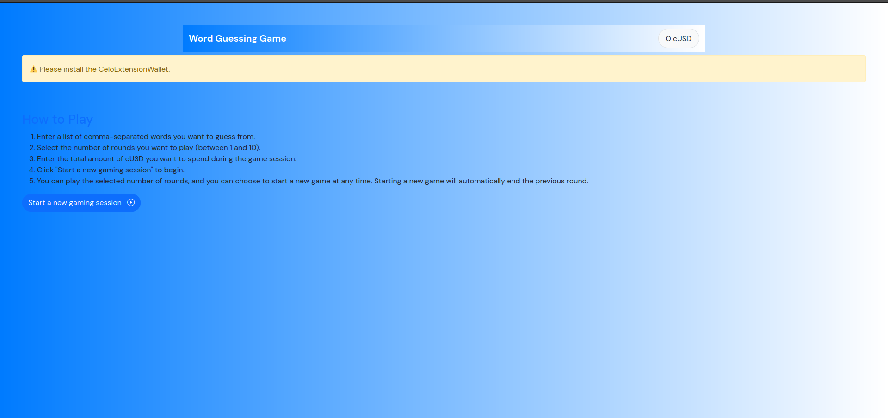
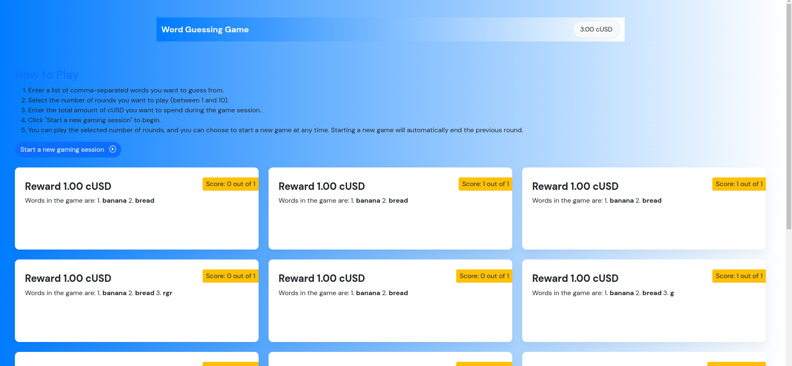
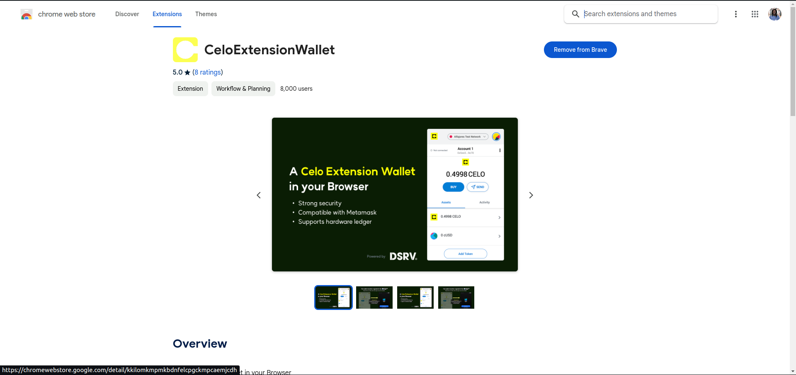
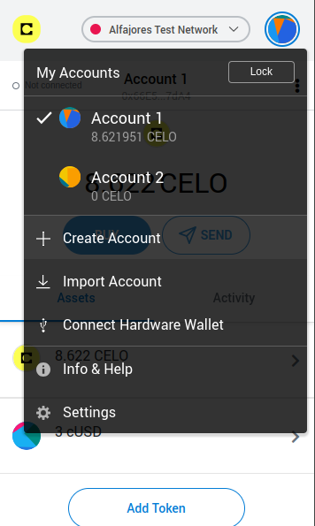
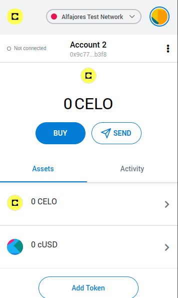
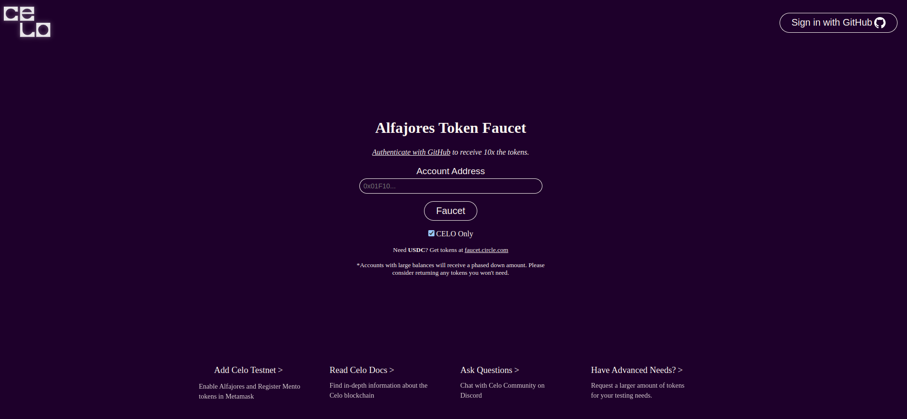

## How to Play

### First Timer

1. Enter a list of comma-separated strings you want to guess from.
2. Enter how many rounds you would like to play.
3. Specify the total amount of cUSD you want to spend in the session.
4. You can play the number of rounds you selected, and you may choose to start a new game. This will automatically end the previous round.

### Returning Player

1. If you have an ongoing set of rounds, you may continue or choose to start a new game.

### Requirements
- **Celo Extension Wallet:** Install the [CeloExtensionWallet](https://chrome.google.com/webstore/detail/celoextensionwallet/kkilomkmpmkbdnfelcpgckmpcaemjcdh?hl=en) from the Google Chrome Store.

- **Create a Wallet:** Create a wallet using the Celo Extension Wallet.


- **Get Test Tokens:** Go to [https://celo.org/developers/faucet](https://celo.org/developers/faucet) and obtain tokens for the Alfajores testnet.

- **Switch to Alfajores Testnet:** Switch to the Alfajores testnet in the Celo Extension Wallet.

## Key Points I Learned While Building This
- **Event Logging:** Utilizing event logging for better transparency and tracking within the contract.
- **Handling ERC20 Tokens:** Properly managing ERC20 token transactions within the contract, avoiding simultaneous charges in both Celo and cUSD.
  
# Install
```
npm install
```
or 
```
yarn install
```

# Start
```
npm run dev
```

# Build
```
npm run build
```

# Usage
1. Install the [CeloExtensionWallet](https://chrome.google.com/webstore/detail/celoextensionwallet/kkilomkmpmkbdnfelcpgckmpcaemjcdh?hl=en) from the Google Chrome Store.
2. Create a wallet.
3. Go to [https://celo.org/developers/faucet](https://celo.org/developers/faucet) and get tokens for the Alfajores testnet.
4. Switch to the Alfajores testnet in the Celo Extension Wallet.